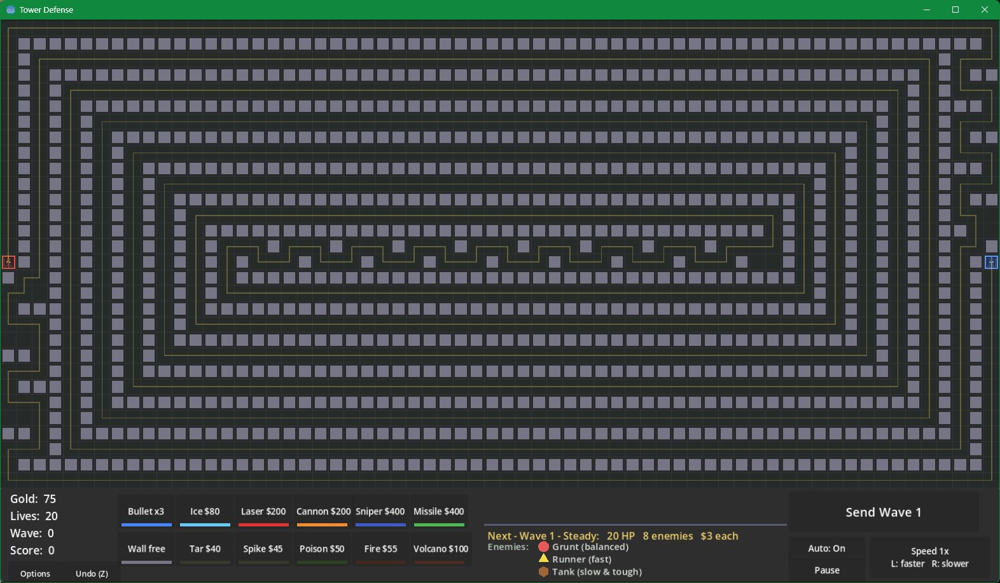
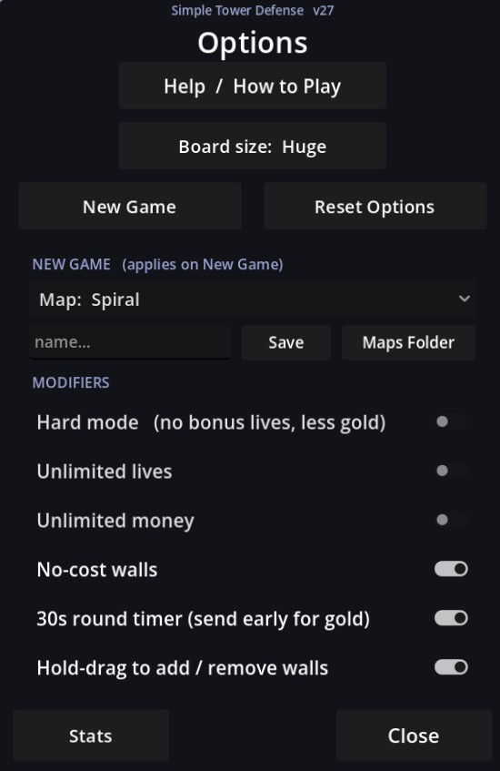

# Simple Tower Defense

An endless, maze-building tower defense game made in **Godot 4.6** (GL Compatibility renderer). Build a labyrinth of walls to route enemies past your towers, mix eight tower types and five traps, and survive as many waves as you can. Everything is drawn with vector primitives — no art assets, just code.



## Features

- **Maze building** — place walls to force a path; a wave won't start unless enemies can still reach the exit.
- **8 towers & 5 traps**, each upgradeable with distinct scaling — including two **support towers** (Gold Mine raises kill gold; Amplifier boosts every adjacent piece's damage, slow, DoT and AOE area).
- **Endless waves** with rotating *deploy styles* so no two waves feel the same.
- **Boss waves** at 5, 15, 25, … with growing numbers of beetles, spiders, and slow, tanky turtles.
- **Maps** — Open field, Spiral, or a procedurally **Generated** single-path labyrinth (a fresh layout each game), plus a built-in editor to paint and save your own.
- **Save / load** — save the **exact mid-game state** (board, economy, *and* live enemies) to **unlimited named save files** at any moment, plus an auto-save each cleared wave with a **Continue** button on the game-over screen.
- **Difficulty modifiers** — Hard mode (no bonus lives, less gold), unlimited lives/money, free walls, round-timer gold bonus, board size, and more, all persisted between sessions.
- **Quality of life** — undo, drag-to-place, bulk upgrades (Alt-click ×10 or **Q** to dump all your gold into one tower), **mass-delete mode** (**D**), send the next **10 / 100 waves** (**T** / **Y**), abbreviated big numbers (12.3K / 4.5M), per-tower range/AOE caps so a maxed tower can't blanket the map, lifetime stats, a Quit-with-save option, and high-speed graphics reduction (up to 1000×).



## Towers

| Tower | Role | Notes |
|-------|------|-------|
| **Bullet** | Cheap single-target | Fire rate climbs with level (caps at 4.0/s) |
| **Cannon** | Splash | Lobs a shell to a spot, AOE on impact |
| **Laser** | Single-target beam | Continuous damage, always one target |
| **Ice** | AOE crowd control | Frost field slows everything in range (no damage) |
| **Sniper** | High single-target | Long range, fire rate doubles every 30 levels |
| **Missile** | Homing splash | Tracks and re-acquires targets; AOE on hit |
| **Gold Mine** | Support | Raises gold earned from kills (+0.5%/level); stacks board-wide |
| **Amplifier** | Support | Boosts the 8 pieces touching it — damage, slow, DoT, AOE area (and an adjacent Gold Mine's rate) |

Towers and traps stop growing in *range/AOE* at a cap (so a maxed tower can't cover the whole map), but their damage, fire rate and effects keep scaling.

## Traps

| Trap | Effect |
|------|--------|
| **Tar** | Pure slow, no damage (5% → 80% by level 40; up to 95% next to an Amplifier) |
| **Spike** | Contact damage |
| **Poison** | Damage over time **and** makes enemies take extra damage from all sources |
| **Fire** | Heavier damage over time |
| **Volcano** | Erupts periodically, AOE damage to everything in its area |

## Enemies & waves

- **Grunt** — balanced. **Runner** — fast, resists poison. **Tank** — slow, tough, resists fire.
- Each wave rotates a deploy style: **Steady**, **Swarm** (fast packs), **Heavy** (tanks), **Squads** (same-type bursts). The next-wave label tells you which.
- **Boss waves** (5, 15, 25, …) layer growing numbers of bosses onto the normal wave — beetles/spiders plus slower, tankier **turtles** that grow each boss level.

## Controls

| Input | Action |
|-------|--------|
| Left-click | Place / upgrade a piece |
| Right-click | Sell a piece |
| Alt + drag | Place (or remove walls) in a straight line |
| Alt + left-click | Upgrade a turret 10 levels at once |
| **Q** | Max out the selected tower (spend all your gold on it) |
| **D** | Toggle mass-delete (left-drag removes pieces; Alt = a whole line) |
| **T** / **Y** | Send the next 10 / 100 waves |
| Alt + Send Wave (or **Alt+Enter**) | Queue the next 10 waves |
| Mouse wheel | Zoom; middle-drag to pan |
| **Space** | Pause |
| **Enter** | Send next wave |
| **+ / -** | Game speed (¼× to 1000×) |
| **Z** | Undo |
| **Esc** | Close popups / exit delete mode / toggle Options (Save · Load · Quit live in Options) |

## Releases

See **[RELEASES.md](RELEASES.md)** for the version history and what changed in each build.

## Run from source

1. Install [Godot 4.6](https://godotengine.org/download) (uses the GL Compatibility renderer).
2. Open the project (`project.godot`) in the Godot editor and press **Play**, or run headless:
   ```sh
   godot4 --path . 
   ```

## Build / export

Export presets are included for **Windows, Linux, macOS, and Web**. From the editor use *Project → Export*, or from the CLI:

```sh
godot4 --headless --export-release "Windows Desktop" build/SimpleTowerDefense.exe
godot4 --headless --export-release "Linux"           build/SimpleTowerDefense
godot4 --headless --export-release "Web"             build/web/index.html
```

## Project layout

```
project.godot          # Godot project config (autoloads: Events, GameState)
scenes/                # Main scene
scripts/
  main.gd              # Root: wires level, wave manager, HUD
  level.gd             # Grid, pathfinding (BFS), placement, input
  wave_manager.gd      # Wave/boss spawning and deploy styles
  hud.gd               # Bar, menus, popups, help text
  tower.gd / trap.gd   # Placeable combat pieces
  enemy.gd / bullet.gd # Enemies and projectiles
  piece_data.gd        # Static stat tables and scaling formulas
  game_state.gd        # Persistent run state, settings, stats
```

## License

_TODO: add a license._
